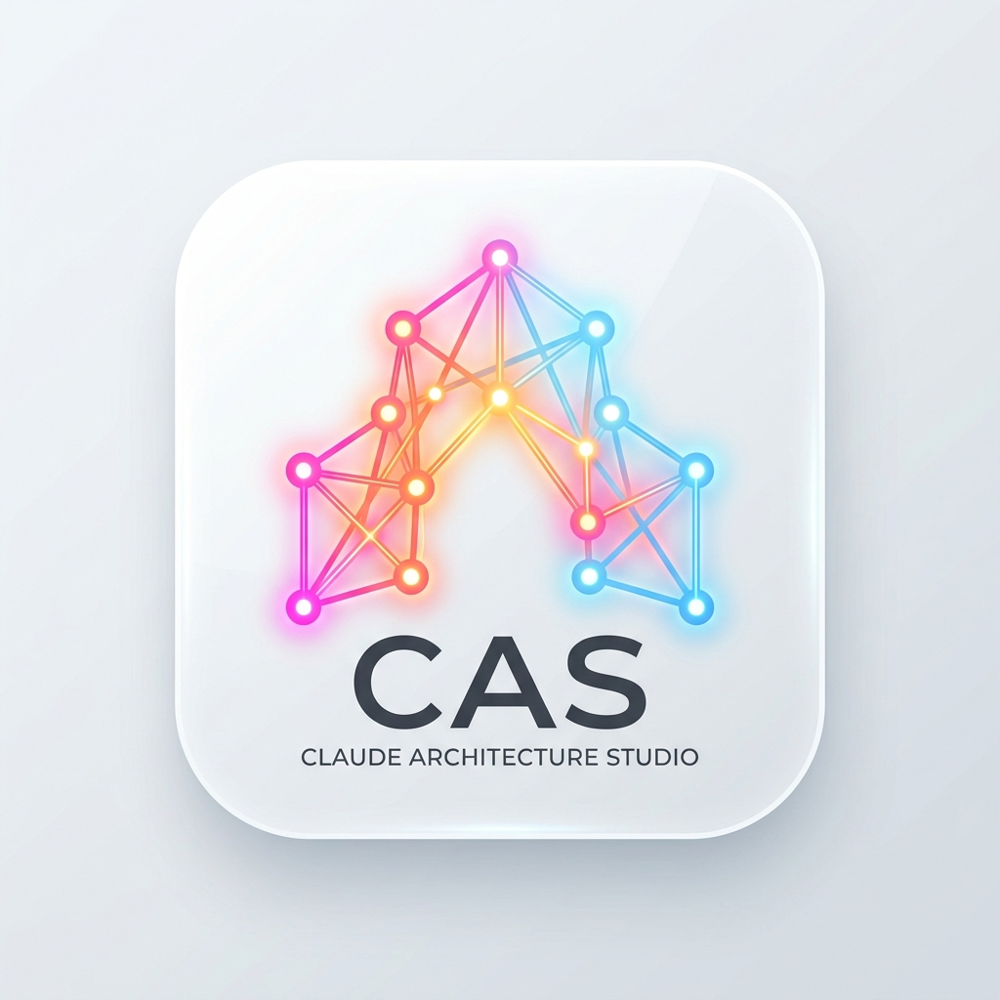
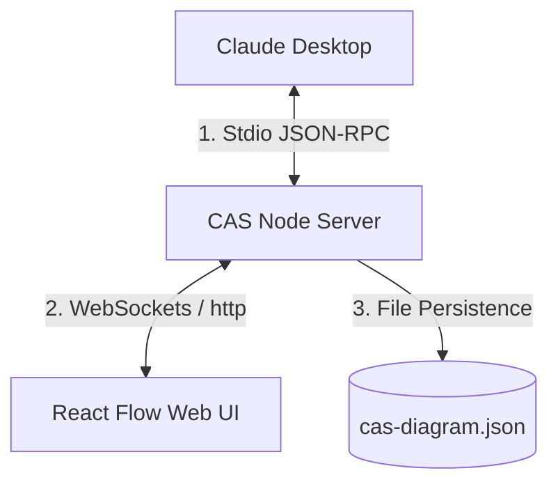

<p align="center">
  
</p>

# 📊 CAS (Claude Architecture Studio)

> **Bidirectional, real-time system architecture and database design studio for Claude.**

CAS is an interactive, visual diagram editor that bridges the gap between text-based AI system design and visual software architecture. It runs as a Model Context Protocol (MCP) server alongside Claude Desktop, hosting a responsive React Flow browser interface. 

As Claude designs your database, microservices, or gateways, the canvas **live-updates in real-time**. You can drag nodes, edit API endpoints, adjust DB schemas, and style connections directly in your browser—with every change syncing back into Claude's context automatically.

---

## 🏛️ How It Works (The Sync Loop)

CAS maintains a persistent state loop between Claude Desktop, the Local Node Backend, and the React browser client:



1. **Claude's Actions**: When you ask Claude to design a system, it calls MCP tools (like `add_node`, `add_edge`) to draw components.
2. **Real-time Broadcast**: The CAS server processes these calls, persists changes to `cas-diagram.json`, and broadcasts state changes to the browser interface via WebSockets.
3. **Developer Edits**: You select components in the browser, update endpoints or table columns, change color schemes, or move nodes. The web client transmits these coordinates and data back to the server, updating the local diagram state.
4. **Context Loop**: The next time Claude runs a query, it reads the updated diagram, keeping it fully aligned with your manual edits.

---

## ✨ Core Features

- **📺 Real-time Web UI**: Responsive, glassmorphic layout styled in premium dark mode.
- **🔄 Bi-directional Updates**: Claude adds nodes and edges $\leftrightarrow$ you drag, modify schemas, or change themes in the browser.
- **🎨 Specialized Node Templates**:
  - `client`: Browser/mobile mockups for frontends.
  - `server`: API cards displaying HTTP endpoint routes (`GET /api/v1/...`).
  - `database`: Cylinder representations with SQL/NoSQL schema tables and lists of fields.
  - `queue`: Horizontal buffers for Kafka, RabbitMQ, or Pub/Sub messaging.
  - `storage`: Buckets (S3) or file storage indicators.
  - `auth`: Cryptographic shield icons representing Cognito, Auth0, or OAuth.
  - `cloud`: Cloud gateways or load balancers.
  - `external`: Third-party APIs (Stripe, Twilio, OpenAI, etc.).
- **⚡ Animated Connections**: Flowing dashed pulses indicating data streams, with customizable speed, label text, and paths (`smoothstep`, `straight`, `bezier`).
- **📐 Smart Layout**: Automatically organizes nodes into logical architectural layers (Clients on the left, Gateways/Auth in the middle-left, Backend APIs in the middle-right, Databases/Storage on the right).
- **💾 Premium Exports**: Download diagram screenshots as PNGs (complete with celebratory confetti!) or copy standard Markdown-compliant **Mermaid code** to paste into wikis or repository code comments.

---

## 🛠️ Quick Start & Installation

### 1. Prerequisites
Ensure you have **Node.js (v18+)** and **npm** installed on your system.

### 2. Build the Project
Clone the repository and build the frontend static files and backend server:
```bash
# Run from the root directory
npm run install:all
npm run build:all
```

### 3. Integrate with Claude Desktop
Add the MCP configuration block to your Claude Desktop configuration file:

* **macOS**: `~/Library/Application Support/Claude/claude_desktop_config.json`
* **Windows**: `%APPDATA%\Claude\claude_desktop_config.json`

```json
{
  "mcpServers": {
    "claude-architecture-studio": {
      "command": "node",
      "args": [
        "/path/to/claude-architecture-studio/server/dist/index.js"
      ]
    }
  }
}
```
*(Make sure to replace the path in `args` with the absolute path to your local `server/dist/index.js` compilation)*.

**Restart Claude Desktop** after updating the config.

---

## 🪄 How to Use CAS Effectively

To get the most out of Claude Architecture Studio, try combining natural language requests with browser-based editing:

### 1. Let Claude Generate the Base Layout
Begin by asking Claude to layout a system architecture. Since CAS is loaded, Claude will automatically open your web browser (via `open_in_browser`) and populate the canvas.

* **Example Prompt**:
  > *"Design a microservice architecture for a video-sharing platform. We need a React web client, an API gateway, a transcribing worker, a metadata database (Postgres), an S3 storage bucket for videos, and an authentication gateway. Please layout the nodes cleanly and start the browser."*

### 2. Live Refinement during Chat
You don't need to rebuild from scratch. You can ask Claude to add or remove layers incrementally.
* **Example Prompt**:
  > *"Add a Redis cache node between the Express server and the Postgres database, and animate the cache hit query stream."*

### 3. Visual Customization & Schema Editing
Use the browser sidebar to add columns or endpoints that are tedious to type in chat:
1. Double-click the **PostgreSQL DB** node on your screen to select it.
2. The sidebar opens. Under **Database Schema**, click **Add Table Schema**.
3. Name it `videos` and type in columns: `id (UUID), title (text), duration (int), url (text)`.
4. Claude automatically gains access to this table metadata. Now type in Claude Desktop chat:
   > *"Write the SQL script and typescript types to fetch and insert records matching the video schema table I just added on the canvas."*

### 4. Interactive Data Flow Adjustments
If Claude connects nodes incorrectly, or if you want to update connectivity:
1. Select the incorrect line in your browser and press `Backspace` or `Delete`.
2. Connect them manually by dragging a path from the source dot (handle) of one card to the target dot of another.
3. The next time you ask Claude a question, it will know about the new path!

---

## 🔧 MCP Tools Reference

Here is the JSON-RPC interface that Claude uses under the hood:

| Tool Name | Parameters | Description |
| :--- | :--- | :--- |
| `get_diagram` | None | Returns the full list of active nodes, edges, coordinates, and details. |
| `set_diagram` | `nodes`, `edges` | Replaces the current canvas state entirely. |
| `add_node` | `id`, `type`, `label`, `x`, `y`, `description`, `endpoints`, `tables`, `themeColor` | Creates a new component card on the grid. |
| `update_node` | `id`, `label`, `x`, `y`, `description`, `endpoints`, `tables`, `themeColor` | Modifies properties of a specific component. |
| `remove_node` | `id` | Deletes a node and disconnects all paths attached to it. |
| `add_edge` | `source`, `target`, `label`, `animated`, `type` | Connects two nodes with a custom styled arrow. |
| `remove_edge` | `id` or `source`, `target` | Removes a connection path. |
| `clear_diagram`| None | Wipes all elements from the canvas. |
| `open_in_browser` | None | Opens the interactive visual UI in the default web browser. |

---

## 📄 Node Data Schema Format
When manually adjusting node structures, this is the layout structure stored in `cas-diagram.json`:

```json
{
  "id": "node-server-1",
  "type": "server",
  "position": { "x": 600, "y": 120 },
  "data": {
    "label": "Express REST API",
    "description": "Core business logic service",
    "themeColor": "green",
    "endpoints": [
      { "method": "GET", "path": "/api/users", "description": "Get profile details" }
    ]
  }
}
```

---

## 💻 Tech Stack
- **Backend**: Node.js, TypeScript, Express, WebSockets (`ws`), `@modelcontextprotocol/sdk`.
- **Frontend**: React, TypeScript, Vite, [@xyflow/react](https://reactflow.dev/) (React Flow), Lucide React, HTML-to-Image.
- **Styling**: Premium Vanilla CSS.
